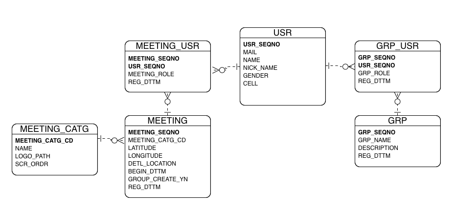

# Together Backend Project
---
## Database
- Mysql 8
- RDS
> 현재 버전 0.0.1

 

#### USR
|   Field   |  Type   |    Desc    |
|:---------:|:-------:|:----------:|
| USR_SEQNO | BIGINT  | 사용자 일련 번호  |
|   MAIL    | VARCHAR |   메일 주소    |
|   NAME    | VARCHAR |   사용자 이름   |
| NICK_NAME | VARCHAR |  사용자 닉네임   |
|  GENDER   |  CHAR   |  성별 구분 코드  |
|   CELL    | VARCHAR | 사용자 핸드폰 번호 |
 

#### MEETING_CATG
|      Field      |  Type   |       Desc        |
|:---------------:|:-------:|:-----------------:|
| MEETING_CATG_CD |  CHAR   |   모임 카테고리 구분 코드   |
|      NAME       | VARCHAR |    모임 카테고리 이름     |
|    LOGO_PATH    | VARCHAR | 모임 카테고리 로고 이미지 경로 |
|      ORDR       |  CHAR   |        순서         |
  

#### MEETING
|      Field      |   Type   |     Desc      |
|:---------------:|:--------:|:-------------:|
|  MEETING_SEQNO  |   INT    |   모임 일련 번호    |
| MEETING_CATG_CD |   CHAR   | 모임 카테고리 구분 코드 |
|    LATITUDE     | DECIMAL  |      위도       |
|    LONGITUDE    | DECIMAL  |      경도       |
|  DETL_LOCATION  | VARCHAR  |     상세 위치     |
|    REG_DTTM     | DATETIME |     등록 일시     |
| EXTRA_INFO_MAP  |   JSON   | 추가정보 (제한사항) 맵 |
|   BEGIN_DTTM    | DATETIME |   모임 시작 일시    |
| GROUP_CREATE_YN |   CHAR   |   그룹 생성 여부    |
  

#### MEETING_USR
|     Field     |   Type   |    Desc     |
|:-------------:|:--------:|:-----------:|
|   USR_SEQNO   |  BIGINT  |  사용자 일련 번호  |
| MEETING_SEQNO |   INT    |  모임 일련 번호   |
| MEETING_ROLE  |   CHAR   | 모임 역할 구분 코드 |
|   REG_DTTM    | DATETIME |  모임 등록 일시   |
  

#### GRP
|    Field    |    Type    |   Desc   |
|:-----------:|:----------:|:--------:|
|  GRP_SEQNO  |    INT     | 그룹 일련 번호 |
|  GRP_NAME   |  VARCHAR   |  그룹 이름   |
| DESCRIPTION | MEDIUMTEXT | 그룹 상세 설명 |
|  REG_DTTM   |  DATETIME  | 그룹 등록 일시 |
  

#### GRP_USR
|   Field   |   Type   |     Desc     |
|:---------:|:--------:|:------------:|
| USR_SEQNO |  BIGINT  |  사용자 일련 번호   |
| GRP_SEQNO |   INT    |   그룹 일련 번호   |
| GRP_ROLE  |   CHAR   | 그룹 역할 구분 코드  |
| REG_DTTM  | DATETIME | 그룹 사용자 가입 일시 |